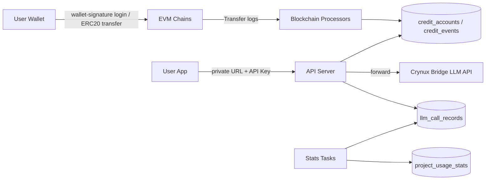

# Technical Architecture

## System Boundary

Crynux AS is one off-chain backend service backed by one MySQL database. It works with multiple configured blockchain networks for receiving ERC20 payments, and with one Crynux Bridge instance for LLM inference. The term `network` in this document means blockchain network.

## Components



* **API server** (`api/`): gin + fizz + tonic HTTP server. Serves the management APIs under `/v1` (auth, account, projects, API keys, stats) and the private OpenAI-compatible LLM endpoints under `/api/<endpoint_token>/v1`. The tonic error and render hooks in `api/v1/response` produce the uniform `{"message": ...}` response envelope, and the OpenAPI specification is generated from the route declarations.
* **Blockchain processors** (`service/`): one worker goroutine per configured network that scans ERC20 `Transfer` logs to the receiving address and converts them into deposits and Credits ledger events.
* **Blockchain clients** (`blockchain/`): one eth client per configured network with a per-network RPS rate limiter. All RPC requests of a network MUST pass through its limiter. The package also provides Ethereum personal-sign signature verification used by wallet login.
* **Bridge client**: forwards LLM requests to the Crynux Bridge using the platform-level Bridge API key from the configuration.
* **Stats tasks** (`tasks/`): background aggregation of `llm_call_records` into `project_usage_stats`.
* **MySQL database**: all persistent state. Schema changes are applied by versioned gormigrate migrations in `migrate/` at startup.

## Startup Order

`main.go` initializes components in this order: config (`config.InitConfig`), logging (`config.InitLog`), database (`config.InitDB`), database migrations (`migrate.InitMigration` + `migrate.Migrate`), blockchain clients (`blockchain.Init`), background workers (blockchain processors, stats tasks), and finally the HTTP server.

## Multi-Chain Multi-Token Configuration Model

The configuration defines a map of blockchain networks, and each network defines a map of supported ERC20 tokens:

```yaml
blockchains:
  <network-name>:
    chain_id: 1
    rpc_endpoint: ""
    rps: 20
    start_block_num: 0
    log_block_range: 1000
    receiving_address: "0x..."
    tokens:
      <token-name>:
        address: "0x..."
        decimals: 6
bridge:
  base_url: ""
  api_key_file: "config/secrets/bridge_api_key.txt"
```

Configuration loading MUST fail with an error when a required item is missing. Each network gets exactly one blockchain client, one scanning worker, and one `blockchain_cursors` row keyed by the network name.

## Data Model

| Table | Content |
|-------|---------|
| `users` | Wallet address as the unique user identity |
| `credit_accounts` | One row per user; the current Credits balance |
| `credit_events` | Append-only Credits ledger; every balance change is one event |
| `deposits` | Detected ERC20 transfers; unique by network + tx hash + log index |
| `blockchain_cursors` | Per-network scan cursor; unique by network |
| `projects` | User projects; unique `endpoint_token` forms the private base URL |
| `api_keys` | Project API keys; only the key hash and public prefix are stored |
| `llm_call_records` | One row per LLM call with token usage, status, charged Credits, and duration |
| `project_usage_stats` | Aggregated usage per project and time period; unique by project + period start |

## Deposit Flow

1. The user transfers a supported ERC20 token from the login wallet to the receiving address of a configured network.
2. The network's blockchain processor reads the scan cursor, fetches `Transfer` logs of all configured token contracts filtered by `to == receiving_address` in ranges of at most `log_block_range` blocks, with each RPC request passing the network RPS limiter.
3. Each log becomes a `deposits` row identified by network + tx hash + log index. The unique index makes re-processing idempotent.
4. The deposit is attributed to the user whose address equals the `from` address of the transfer. The token amount is converted to Credits, a `credit_events` row of type deposit is created, and the `credit_accounts` balance is updated.
5. The cursor advances only after all logs in the range are durably recorded.

## LLM Call Charging Flow

1. The client sends an OpenAI-compatible request to `/api/<endpoint_token>/v1/...` with a project API key in the `Authorization` header.
2. The API server locates the project by `endpoint_token`, validates the API key hash against the project's active keys, and checks the account Credits balance. Requests with insufficient balance are rejected with HTTP 402.
3. The request is forwarded to the Crynux Bridge (`/v1/llm/chat/completions` or `/v1/llm/completions`) with the platform Bridge API key. For streaming requests, `stream_options.include_usage: true` is injected so the final stream chunk carries the `usage` payload; this chunk is not exposed to clients that did not request it.
4. The charge is calculated from the response `usage` token counts and the configured per-model unit prices. A `credit_events` row of type LLM charge decreases the account balance, and one `llm_call_records` row records the call.
5. The stats task periodically aggregates call records into `project_usage_stats`.

## Credits Ledger Consistency Rules

* Every Credits balance change MUST be recorded as a `credit_events` row; the `credit_accounts` balance MUST equal the sum of its processed events.
* Ledger event creation and the corresponding balance update MUST be committed atomically in one database transaction.
* Event identity (`reason`) is unique; retrying an operation MUST NOT produce a duplicate event.
* Deposit crediting and LLM charging may be delayed, but processed data MUST remain correct and consistent across unexpected exceptions and shutdown.
