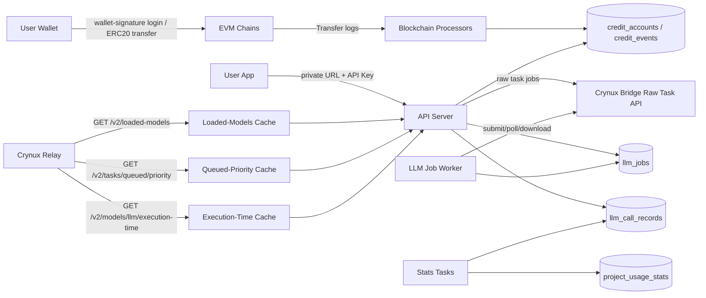

# Technical Architecture

## System Boundary

Crynux AS is one off-chain backend service backed by one MySQL database. It works with multiple configured blockchain networks for receiving ERC20 payments, with one Crynux Bridge instance for LLM inference, and with one Crynux Relay instance for the loaded LLM model catalog. The term `network` in this document means blockchain network.

## Components



* **API server** (`api/`): gin + fizz + tonic HTTP server. Serves the management APIs under `/v1` (auth, account, projects, project API key reset, stats) and the private OpenAI-compatible LLM endpoints under `/api/<endpoint_token>/v1`. The tonic error and render hooks in `api/v1/response` produce the uniform `{"message": ...}` response envelope, and the OpenAPI specification is generated from the route declarations.
* **Blockchain processors** (`service/`): one worker goroutine per configured network that scans ERC20 `Transfer` logs to the receiving address and converts them into deposits and Credits ledger events.
* **Blockchain clients** (`blockchain/`): one eth client per configured network with a per-network RPS rate limiter. All RPC requests of a network MUST pass through its limiter. The package also provides Ethereum personal-sign signature verification used by wallet login.
* **Bridge client** (`bridge/`): submits persisted LLM jobs to the Crynux Bridge raw task APIs using the platform-level Bridge API key from the configuration. AS parses public OpenAI requests into canonical `GPTTaskArgs`, queries Bridge ClientTask status, downloads raw `GPTTaskResponse` JSON, and formats chat completions, completions, and responses output locally. The resolved effective VRAM is sent as `min_vram` on raw task creation. See [llm-api.md](./llm-api.md).
* **LLM job worker** (`service/`, `tasks/`): one background loop that each tick loads a bounded batch of unfinished `llm_jobs`, batch-submits `pending_submit` jobs to Bridge, batch-queries ClientTask status for in-flight jobs, downloads a raw result for each successful job, formats results through `llmadapter/`, and performs one-time Credits settlement before marking the job `completed`. The loop MUST NOT block on a single job until that job reaches a terminal Bridge status. Worker startup MUST recover incomplete jobs from the database.
* **Relay client** (`relay/`): calls the public Relay APIs without authentication: `GET {relay.base_url}/v2/loaded-models`, `GET {relay.base_url}/v2/tasks/queued/priority`, and `GET {relay.base_url}/v2/models/llm/execution-time`.
* **Loaded-models cache** (`service/`): one in-memory snapshot of the Relay loaded models with `model_type == "llm"`, keyed by lowercase `model_id`. The cache MUST be refreshed once at startup before the HTTP server starts and then every `llm.loaded_models_refresh_interval` seconds by a background task in `tasks/`. A failed startup refresh MUST be logged, MUST leave the cache empty, and MUST NOT prevent startup. A failed periodic refresh MUST retain the last successful snapshot and retry at the next interval. A successful refresh MUST replace the whole snapshot. The cache is not persisted to the database.
* **Queued-priority cache** (`service/`): one in-memory snapshot of the Relay queued-task priority range from `GET /v2/tasks/queued/priority`. The cache MUST be refreshed once at startup before the HTTP server starts and then every `llm.queued_priority_refresh_interval` seconds by a background task in `tasks/`. A failed startup refresh MUST be logged and MUST NOT prevent startup. A failed periodic refresh MUST retain the last successful snapshot and retry at the next interval. A successful refresh MUST replace the snapshot. When a successful refresh returns an empty queue, the cache MUST retain the most recent non-empty `median_priority_gwei` for management UI cost-level hints. The live median MUST NOT enter Credits or task fee. The cache is not persisted to the database.
* **Execution-time cache** (`service/`): an in-memory TTL cache of LLM execution-time coefficients keyed by `(model, effective_vram)`. Entries MUST be fetched on demand from Relay `GET /v2/models/llm/execution-time` with `model` and `min_vram=effective_vram`. The TTL MUST be `llm.execution_time_cache_ttl` seconds. The cache MUST NOT run a full-catalog refresh timer. The cache is not persisted to the database.
* **Stats tasks** (`tasks/`): background aggregation of `llm_call_records` into `project_usage_stats`.
* **MySQL database**: all persistent state. Schema changes are applied by versioned gormigrate migrations in `migrate/` at startup.

## Startup Order

`main.go` initializes components in this order: config (`config.InitConfig`), logging (`config.InitLog`), database (`config.InitDB`), database migrations (`migrate.InitMigration` + `migrate.Migrate`), blockchain clients (`blockchain.Init`), background workers (blockchain processors, stats tasks, LLM job worker), the initial loaded-models and queued-priority cache refreshes and their periodic refresh tasks, and finally the HTTP server.

## Multi-Chain Multi-Token Configuration Model

The configuration defines a map of blockchain networks, and each network defines a map of supported ERC20 tokens:

```yaml
blockchains:
  <network-name>:
    chain_id: 1
    rpc_endpoint: ""
    rps: 20
    start_block_num: 0
    log_block_range: 1000
    scan_interval: 5
    receiving_address: "0x..."
    tokens:
      <token-name>:
        address: "0x..."
        decimals: 6
        credits_per_token: 1
bridge:
  base_url: ""
  api_key_file: "config/secrets/bridge_api_key.txt"
relay:
  base_url: ""
llm:
  default_max_tokens: 2048
  default_vram_limit: 24
  loaded_models_refresh_interval: 1800
  queued_priority_refresh_interval: 300
  execution_time_cache_ttl: 300
  base_vram: 8
  empty_queue_median_priority_gwei: "34"
  reference_priority_gwei: "34"
  credits_per_gwei: 1
  max_token_ratio: 30
  job_submit_timeout: 600
```

Configuration loading MUST fail with an error when a required item is missing. Each network gets exactly one blockchain client, one scanning worker, and one `blockchain_cursors` row keyed by the network name. The worker polls on `scan_interval` seconds. Credits for a deposit are computed as `amount * credits_per_token / 10^decimals` using integer arithmetic. `relay.base_url` is the public Relay URL for loaded-models, queued-priority, and execution-time fetches. The shared LLM configuration items are specified in [llm-api.md](./llm-api.md). Credits billing and the shared `billable_gwei` / reference-priority task fee inputs are specified in [credits-billing.md](./credits-billing.md).

## Data Model

| Table | Content |
|-------|---------|
| `users` | Wallet address as the unique user identity |
| `credit_accounts` | One row per user; the current Credits balance |
| `credit_events` | Append-only Credits ledger; every balance change is one event referencing its source record by `ref_id`; unique by type + `ref_id` |
| `deposits` | Detected ERC20 transfers; unique by network + tx hash + log index |
| `blockchain_cursors` | Per-network scan cursor; unique by network |
| `projects` | User projects; unique `endpoint_token` forms the private base URL; stores the project API key hash, public prefix, and `token_ratio` |
| `llm_jobs` | Persisted LLM jobs for chat completions, completions, and responses; stores canonical task args, Bridge client task ID, execution status, raw and formatted results, usage, billing status, execution-time coefficients, task-fee fields, and optional public response ID |
| `llm_call_records` | One row per LLM call with token usage, status, charged Credits, duration, billed effective VRAM, and optional task-fee estimation fields |
| `project_usage_stats` | Aggregated usage per project and time period; unique by project + period start |

## Deposit Flow

1. The user transfers a supported ERC20 token from the login wallet to the receiving address of a configured network.
2. The network's blockchain processor ticks on `scan_interval`, reads the scan cursor, and fetches `Transfer` logs of all configured token contracts filtered by `to == receiving_address` in ranges of at most `log_block_range` blocks, with each RPC request passing the network RPS limiter.
3. When no user account exists for the transfer `from` address, the processor emits a warning log and ignores the transfer. No `deposits` or `credit_events` row is created.
4. When the user exists, the log becomes a `deposits` row identified by network + tx hash + log index. The unique index makes re-processing idempotent. The token amount is converted to Credits with `credits_per_token`, a `credit_events` row of type deposit referencing the deposit ID is created, and the `credit_accounts` balance is updated in the same database transaction.
5. The cursor advances only after all logs in the range are handled (credited or ignored).

## LLM Call Charging Flow

The authoritative Credits charging rules are specified in [credits-billing.md](./credits-billing.md). Task Fee Estimation is specified in [llm-api.md](./llm-api.md). The high-level flow is:

1. The client sends an OpenAI-compatible request to `/api/<endpoint_token>/v1/...` with a project API key in the `Authorization` header.
2. The API server locates the project by `endpoint_token`, validates the API key hash against the project's stored key hash, and resolves the effective VRAM from the user `vram_limit`, the loaded-models cache, and the configured default.
3. The API server fetches and validates LLM execution-time coefficients, computes one shared `billable_gwei`, rejects with HTTP 402 when Credits precheck fails, sets `task_fee_gwei = floor(billable_gwei)`, resolves a Queue Median Hint snapshot, and persists fee fields and coefficients on the LLM job. Coefficient fetch or validation failure MUST return HTTP 500, MUST record a failed call without fee fields, and MUST NOT create an LLM job for forwarding. The live median MUST NOT enter `billable_gwei`.
4. The API server creates an `llm_jobs` row with canonical `GPTTaskArgs` and returns immediately for responses with `background=true`, or waits synchronously for chat completions, completions, and responses with `background=false`.
5. The LLM job worker converts the persisted GWei fee to Wei and submits unfinished jobs through Bridge raw task batch create. Each successful create persists the returned Bridge client task ID. On later ticks the worker batch-queries ClientTask status, downloads the raw `GPTTaskResponse` for each successful job, formats the public API result, settles Credits, and only then marks the job `completed`.
6. The charge is calculated from the raw result `usage` token counts, the project `token_ratio`, the persisted execution-time coefficients, `vram_weight`, `reference_priority_gwei`, and `credits_per_gwei`. One `llm_call_records` row records the call together with the billed effective VRAM and the pre-submit task-fee fields (`estimated_node_seconds` remains the pre-forward estimate), and a `credit_events` row of type LLM charge referencing the call record ID decreases the account balance when settle succeeds.
7. The stats task periodically aggregates call records into `project_usage_stats`.

## Credits Ledger Consistency Rules

* Every Credits balance change MUST be recorded as a `credit_events` row; the `credit_accounts` balance MUST equal the sum of its processed events.
* Ledger event creation and the corresponding balance update MUST be committed atomically in one database transaction.
* Every ledger event references its source record by `ref_id`: the `deposits` row ID for deposit events, and the `llm_call_records` row ID for LLM charge events. The event type + `ref_id` pair is unique; retrying an operation MUST NOT produce a duplicate event.
* Deposit crediting and LLM charging may be delayed, but processed data MUST remain correct and consistent across unexpected exceptions and shutdown.
