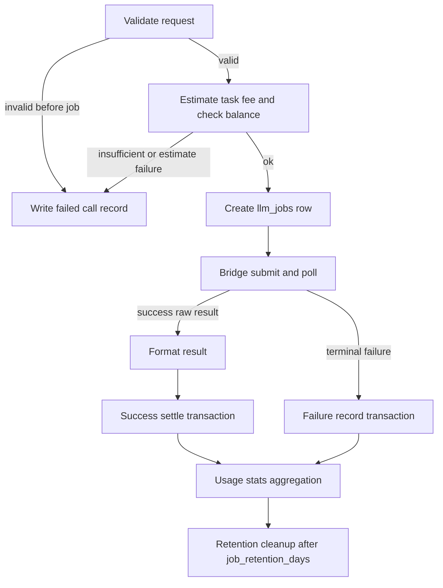

# LLM Job Processing

This document is the authority for `llm_jobs`, `llm_call_records`, `credit_events`, and `credit_accounts` ownership during LLM request processing. API field contracts remain in [llm-api.md](./llm-api.md). Credits formulas remain in [credits-billing.md](./credits-billing.md). System structure remains in [architecture.md](./architecture.md).

## Table Responsibilities

### `llm_jobs`

`llm_jobs` MUST store execution state for an accepted LLM request while the job remains within the configured retention window.

Each row MUST contain:

* project and user ownership
* API type, model, billed effective VRAM, request body, and fully expanded canonical `TaskArgsJSON`
* Bridge client task ID when submitted
* execution status and billing status
* raw result JSON and formatted result JSON when available
* pre-submit task-fee fields and execution-time coefficients used for later settle
* optional Responses public ID
* `llm_call_record_id` after the terminal settle or failure record transaction commits
* `started_at` and `completed_at` when set

`llm_jobs` MUST NOT be the permanent store of billed token counts. Final prompt, completion, and total token counts MUST live only on `llm_call_records`.

Retention:

* Terminal jobs with status `completed` and billing status `billed`, or status `failed` and billing status `not_billed`, and with a non-null `llm_call_record_id`, MUST be deleted when `completed_at` is older than `llm.job_retention_days`.
* Non-terminal jobs, terminal jobs without a call record, and jobs still pending billing MUST NOT be deleted.
* The retention cleanup worker MUST select a bounded batch of candidate IDs through the terminal cleanup index, delete only that batch in one transaction, and repeat until a batch deletes fewer than the batch size.

### `llm_call_records`

`llm_call_records` MUST permanently store one finished call for usage stats, Recent Requests finished rows, Charges join targets, and Credits recalculation inputs.

Each row MUST contain:

* account `user_id` snapshot, project, model, and optional unique `llm_job_id`
* final status (`success` or `failed`)
* prompt, completion, and total token counts when token usage applies
* `token_usage_applicable`
* `token_ratio`
* `accepted_at`, `completed_at`, and `duration_ms = completed_at - accepted_at`
* billed effective VRAM
* optional pre-submit task-fee fields (`task_fee_gwei`, `median_priority_gwei`, `estimated_node_seconds`, `vram_weight`)
* for settled success charges, the Credits recalculation snapshot: `constant_seconds`, `seconds_per_input_token`, `seconds_per_output_token`, `reference_priority_gwei`, and `credits_per_gwei`

`llm_call_records` MUST NOT store request bodies, prompts, completions, result bodies, or the actual Credits amount charged.

`llm_job_id` MUST remain as the source identifier and settle dedupe key. It is not a foreign key. After a job is deleted, the call record MUST keep `llm_job_id` unchanged.

### `credit_events`

`credit_events` MUST permanently store every actual Credits balance change.

For LLM charging:

* A processed LLM charge event MUST reference the call record ID in `ref_id`.
* The event `amount` MUST be the actual Credits debit applied to the account.
* The `(type, ref_id)` pair MUST be unique so one call record produces at most one LLM charge event.

When settle computes a positive Credits amount but the account balance is insufficient, the service MUST write the success call record, MUST NOT create an LLM charge event, and MUST leave the account balance unchanged.

### `credit_accounts`

`credit_accounts.balance` MUST equal the sum of that user's processed `credit_events` amounts after every committed deposit or LLM charge transaction. New writes after this schema MUST make that equality verifiable from processed events alone.

## Request Processing Flow

### Validation failure before job creation

When authentication succeeds but request validation, VRAM resolution, task-fee estimation, or balance precheck fails before an `llm_jobs` row is created, the API MUST write one failed `llm_call_records` row and MUST NOT create a job, MUST NOT create a Credits event, and MUST NOT change the account balance.

### Job creation

When the request is accepted for execution, the API MUST create one `llm_jobs` row with status `pending_submit`, create-time snapshots for user, token ratio, VRAM, task-fee fields, and execution-time coefficients, and the fully expanded `TaskArgsJSON`.

For Responses requests with `previous_response_id`, the API MUST resolve the previous job before creating the new job:

* The previous job MUST belong to the same project.
* The previous job MUST be a Responses job with status `completed`.
* The previous job MUST still be inside `llm.job_retention_days` from `completed_at`.
* The API MUST build history from the previous job's `TaskArgsJSON` and `raw_result_json`, strip leading system messages that came from that previous call's instructions, append the previous assistant output, then append this request's instructions and input.
* The new job MUST store the fully expanded message list in `TaskArgsJSON` so later execution and later `previous_response_id` references do not require ancestor jobs to still exist.
* Missing, cross-project, expired, non-Responses, incomplete, or failed previous IDs MUST return an invalid-request error that does not reveal other projects' data.

### Bridge submit, status query, download, and format

The LLM job worker MUST:

1. Submit `pending_submit` jobs to Bridge and store the Bridge client task ID.
2. Poll in-flight jobs and move them to `in_progress` when Bridge reports progress.
3. Download the raw result for a successful Bridge task.
4. Format the public API payload through `llmadapter/`.
5. Enter the success settle transaction or the failure record transaction exactly once.

A `pending_submit` job older than `llm.job_submit_timeout` seconds MUST be marked failed through the failure record transaction and MUST NOT be submitted to Bridge.

### Success settle transaction

The success settle transaction MUST lock the job row and, in one commit, write:

1. one success `llm_call_records` row with final tokens and the Credits recalculation snapshot
2. when charged amount is greater than zero and balance is sufficient, one processed LLM `credit_events` row and the matching `credit_accounts` debit
3. the job terminal update to status `completed`, billing status `billed`, raw and formatted results, `completed_at`, and `llm_call_record_id`

The transaction MUST NOT write final token counts onto the job row. The transaction MUST NOT write the charged Credits amount onto the call record.

If the job already has `llm_call_record_id`, or is already `completed` and `billed`, the settle path MUST leave existing rows unchanged and MUST NOT create another call record or Credits event.

### Failure record transaction

The failure record transaction MUST lock the job row and, in one commit, write:

1. one failed `llm_call_records` row
2. the job terminal update to status `failed`, billing status `not_billed`, error message, `completed_at`, and `llm_call_record_id`

It MUST NOT create a Credits event and MUST NOT change the account balance.

If the job is already terminal with a call record, the failure path MUST leave existing rows unchanged.

### Responses lookup

`GET /responses/:id` MUST return the job's pending, completed, or failed Responses object while the job remains readable for the same project.

When a completed Responses job's `completed_at` is older than `llm.job_retention_days`, or the job has already been deleted by retention cleanup, `GET /responses/:id` MUST return HTTP 404.

### Recent Requests

`GET /v1/projects/:project_id/requests` MUST return one merged list of:

* unfinished jobs for the project with statuses mapped to `queued` or `in_progress`
* finished call records for the project with statuses mapped to `success` or `failed`

The handler MUST run one MySQL statement that:

1. selects at most `llm.project_recent_requests_limit` unfinished jobs through the project/status/created index
2. selects at most `llm.project_recent_requests_limit` call records through the project/created index
3. left-joins processed LLM charge events only to that bounded call-record candidate set
4. unions the two candidate sets and applies the final limit with deterministic descending order by accepted/created time, source, and id

In-progress items MUST return null for tokens, duration, and credits. Finished items MUST return credits from the processed event amount, or `0` when no event exists.

Each item MUST include `source` (`job` or `call_record`) and numeric `id`. Clients MUST treat `(source, id)` as the stable row key.

### Charges

`GET /v1/account/charges` MUST select processed LLM charge events for the authenticated user through the user/type/status/id index, compute total from that event set, then join only the selected event `ref_id` values to `llm_call_records`. The response `credits` field MUST equal the event amount.

### Usage stats

Usage stats workers MUST read token counts and success/failure status from `llm_call_records`, and MUST read charged Credits only from processed LLM `credit_events` referenced by call record ID.

## Status Mapping

| Job status | Recent Requests status | Responses status |
|------------|------------------------|------------------|
| `pending_submit` | `queued` | `queued` |
| `submitted` | `in_progress` | `in_progress` |
| `in_progress` | `in_progress` | `in_progress` |
| `completed` | represented by call record `success` | `completed` |
| `failed` | represented by call record `failed` | `failed` |

Finished Recent Requests rows MUST come from `llm_call_records`, not from terminal `llm_jobs` rows.

## Idempotency Rules

Any retry, duplicate worker tick, or repeated settle/failure call MUST satisfy all of the following:

* at most one `llm_call_records` row per `llm_job_id`
* at most one LLM charge `credit_events` row per call record ID
* at most one balance debit for that charge
* job `llm_call_record_id` set only after the matching call record exists in the same transaction
